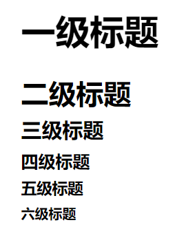

文档
====

NEW-TO-Sphinx
--------------

我们使用Sphinx来生成文档,
其中Sphinx使用的一种叫reStructuredText标记语言。

Sphinx可以自动将文档生成pdf, epub, html等不同格式,
也能进行文档的一键式部署，这些特性使得其广受开源社区欢迎,
包括Linux, fio等开源项目均采用Sphinx作为文档编写工具。

Sphinx安装
~~~~~~~~~~~~~~~

当前文档使用 ``Sphinx 4.5.0`` 或者更高版本生成。

安装Sphinx, 可以使用 ``pip`` 进行安装,
方便管理python包。

.. code-block:: shell

    pip install -U Sphinx

.. note:: 

    推荐在python的虚拟机 ``venu`` 中进行安装,
    可以更加方便地移植,
    备份你的python环境

Sphinx其他需要的python包
~~~~~~~~~~~~~~~~~~~~~~~~~~~~

.. warning:: 
    
    目前需要的python包仅有 ``furo``, 
    需要自己用 ``pip`` 安装一下

    我还在尝试修改一个perl脚本 ``scripts/sphinx-pre-install`` 
    来实现自动检查 ``Sphinx`` 版本,
    以及需要安装的包，但似乎目前时间上还不够充裕

html 文档输出
~~~~~~~~~~~~~~

.. code-block:: shell

    cd Documentation
    make html

Sphinx online deployment
~~~~~~~~~~~~~~~~~~~~~~~~~~
参考 `官方文档 <https://www.sphinx-doc.org/en/master/tutorial/deploying.html>`_

.. warning:: 
    
    在 ``Github Pages`` 上部署文档，可能会碰到css样式失效的问题，
    这是因为 ``Github Pages`` 托管在jekyll上，需要加上一个空的 ``.nojekyll`` 文件

HOW-WRITE-DOCS
----------------

加入新的文档
~~~~~~~~~~~~

reStructuredText语法介绍
~~~~~~~~~~~~~~~~~~~~~~~~~

.. note:: 
    这里只列出了部分语法，如果在文档中使用到了新的语法，请在下面 **补上**。

    更多的语法可以在
    `Sphinx 官方文档找到 <https://www.sphinx-doc.org/en/master/contents.html>`_,
    也可以参考Megengine的教程 [2]_

字体样式
~~~~~~~~~~

.. note:: 
    注意当前后有其他字符时，加空格才能生效。

斜体
+++++++

*斜体*

.. code-block:: restructuredtext

    *斜体*
    .. 或者
    `斜体`

粗体
+++++

**粗体**

.. code-block:: restructuredtext

    **粗体**

等宽按钮
+++++++++

``按钮``

.. code-block:: restructuredtext

    ``按钮``

多级标题
~~~~~~~~~
reStructuredText提供了类似于 ``Markdown`` 中 ``#``
功能的多级标题，如下：

.. .. image:: gnu.png
..    :height: 100px (length)
..    :width: 200px (length or percentage of the current line width)
..    :scale: integer percentage (the "%" symbol is optional)
..    :alt: alternate text
..    :align: "top", "middle", "bottom", "left", "center", or "right"
..    :target: text (URI or reference name)

只需要通过如下代码实现：

.. code-block:: restructuredtext

    一级标题
    ========

    二级标题
    ---------

    三级标题
    ~~~~~~~~

    四级标题
    ++++++++

    五级标题
    #########

    六级标题
    *********

列表
~~~~~~

表格
~~~~~~

图片
~~~~

.. warning:: 
    注意文档中所使用的图片尽量放置在 ``source/_static/images`` 目录内,
    特别是全局可能被使用的图片,
    这是为了防止交叉引用不同文件夹下图片带来的维护困难。

    一般情况下请优先使用 SVG 格式的矢量图，使用位图请权衡好图片体积和清晰度。

    尽可能使用 Graphviz 或 Mermaid 语法绘制流程图。

    图片文件名需要有相应的语义信息，不可使用完全随机生成的字符。

普通图片
++++++++

流程图
+++++++

Graphviz语法
#############

Mermaid语法
#############

注释
~~~~

交叉引用
~~~~~~~~

脚注
~~~~~
当我们引用别人的内容，最好在文档中标出😂，如下：

Code that you wrote 6 months ago is often 
indistinguishable. [1]_

代码如下：

.. code-block:: restructuredtext

    Code that you wrote 6 months ago is often 
    indistinguishable. [1]_

    .. rubric:: Footnotes

    .. [1] `Beginners Guide To Docs <https://www.writethedocs.org/guide/writing/beginners-guide-to-docs/#you-will-be-using-your-code-in-6-months/>`_

引用
~~~~~

其他注意事项
~~~~~~~~~~~~

尽量不要在rst文件的 *中文文本* 中一行话中途换行, 
否则可能出现多余的空格。这可能和这个模板没有特别支持中文有关。

你可以使用英文逗号来解决这个问题。

比如这句话，这样
就会有一个空格。

如下：

.. code-block:: restructuredtext

    .. 正确的
    尽量不要在rst文件的 *中文文本* 中一行话中途换行, 
    否则可能出现多余的空格。

    .. 错误的
    比如这句话，这样
    就会有一个空格。

.. rubric:: Footnotes

.. [1] `Beginners Guide To Docs <https://www.writethedocs.org/guide/writing/beginners-guide-to-docs/#you-will-be-using-your-code-in-6-months/>`_
.. [2] `megengine的Sphinx教程 <https://www.megengine.org.cn/doc/stable/zh/development/docs/restructuredtext.html#graphviz-ext>`_
.. https://www.jianshu.com/p/1885d5570b37
